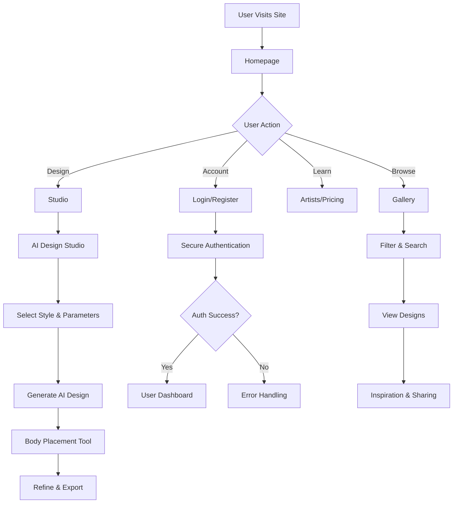
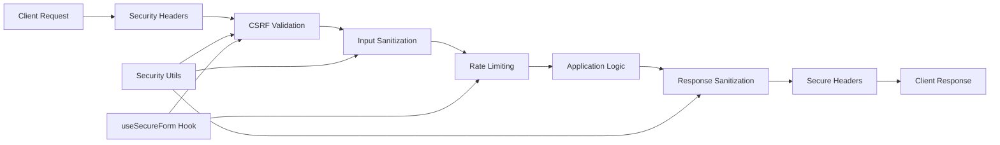
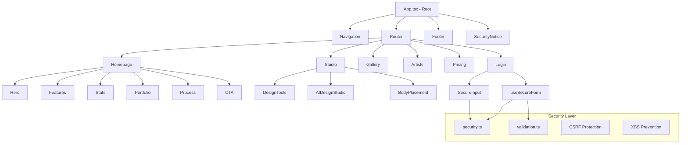
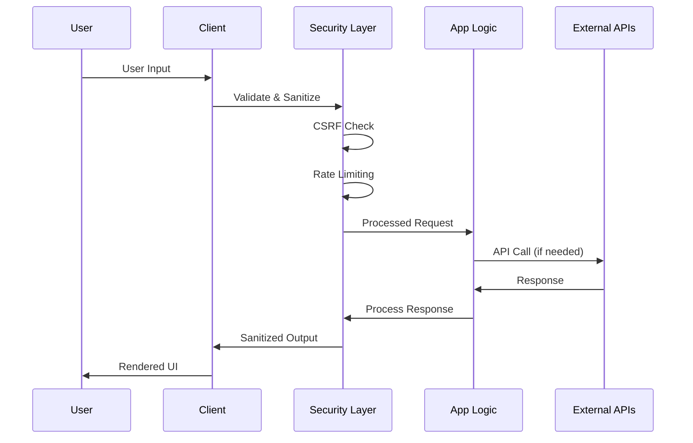

# 🏗️ InkAI Studio - System Architecture

## 🎯 System Overview
InkAI Studio is a modern web application built with React and TypeScript, featuring AI-powered tattoo design generation, secure user authentication, and professional-grade design tools.

## 🔄 User Flow Diagram



## 🔐 Security Architecture



## 🎨 Component Architecture



## 🗄️ Data Flow Architecture



## 🔧 Technology Stack

### Frontend Framework
- **React 18.3.1**: Component-based UI library
- **TypeScript 5.5.3**: Type-safe JavaScript
- **Vite 5.4.2**: Fast build tool and dev server

### Styling & UI
- **Tailwind CSS 3.4.1**: Utility-first CSS framework
- **Framer Motion 11.3.0**: Animation library
- **Lucide React 0.344.0**: Icon library

### Forms & Validation
- **React Hook Form 7.47.0**: Form state management
- **Zod 3.22.4**: Schema validation
- **@hookform/resolvers 3.3.2**: Form validation integration

### Security
- **DOMPurify 3.0.5**: XSS protection
- **js-cookie 3.0.5**: Secure cookie management
- **Helmet 7.1.0**: Security headers

### Development Tools
- **ESLint**: Code linting
- **TypeScript ESLint**: TypeScript-specific linting
- **Autoprefixer**: CSS vendor prefixes
- **Vite PWA**: Progressive Web App features

## 🏛️ Component Design Patterns

### 1. Container/Presentational Pattern
```typescript
// Container Component (Logic)
const StudioContainer = () => {
  const [design, setDesign] = useState(null);
  const handleGenerate = () => { /* logic */ };
  return <StudioPresentation design={design} onGenerate={handleGenerate} />;
};

// Presentational Component (UI)
const StudioPresentation = ({ design, onGenerate }) => {
  return <div>{/* UI only */}</div>;
};
```

### 2. Custom Hooks Pattern
```typescript
// Reusable logic in custom hooks
const useSecureForm = (schema, onSubmit) => {
  // Security, validation, and form logic
  return { form, handleSubmit, isRateLimited };
};
```

### 3. Compound Component Pattern
```typescript
// Complex components with sub-components
<PricingCalculator>
  <PricingCalculator.Form />
  <PricingCalculator.Breakdown />
  <PricingCalculator.Actions />
</PricingCalculator>
```

## 🔒 Security Implementation

### Input Sanitization
- **DOMPurify**: Sanitizes HTML content
- **Custom sanitizeInput**: Removes dangerous characters
- **Zod validation**: Schema-based input validation

### CSRF Protection
- **Token generation**: Cryptographically secure tokens
- **Cookie storage**: Secure, SameSite cookies
- **Form validation**: Automatic token validation

### Rate Limiting
- **Client-side tracking**: Prevents abuse
- **Configurable limits**: Per-endpoint rate limits
- **Graceful degradation**: User-friendly error messages

### Content Security Policy
- **Strict CSP headers**: Prevents XSS attacks
- **Nonce-based scripts**: Secure script execution
- **Report violations**: CSP violation reporting

## 🚀 Performance Optimizations

### Code Splitting
```javascript
// Automatic route-based splitting
const Gallery = lazy(() => import('./pages/Gallery'));
const Studio = lazy(() => import('./pages/Studio'));
```

### Bundle Optimization
```javascript
// Manual chunk splitting in vite.config.ts
manualChunks: {
  vendor: ['react', 'react-dom'],
  router: ['react-router-dom'],
  animation: ['framer-motion'],
  forms: ['react-hook-form', '@hookform/resolvers', 'zod'],
  security: ['dompurify', 'js-cookie']
}
```

### Image Optimization
- **Lazy loading**: Intersection Observer API
- **Progressive enhancement**: Low-quality placeholders
- **WebP support**: Modern image formats

## 🔄 State Management

### Local State
- **useState**: Component-level state
- **useReducer**: Complex state logic
- **Custom hooks**: Shared stateful logic

### Form State
- **React Hook Form**: Optimized form performance
- **Zod validation**: Type-safe validation
- **Error handling**: User-friendly error messages

### Security State
- **CSRF tokens**: Automatic token management
- **Rate limiting**: Client-side tracking
- **Authentication**: Secure session management

## 📱 Responsive Design Strategy

### Mobile-First Approach
```css
/* Base styles for mobile */
.component { /* mobile styles */ }

/* Tablet and up */
@media (min-width: 768px) {
  .component { /* tablet styles */ }
}

/* Desktop and up */
@media (min-width: 1024px) {
  .component { /* desktop styles */ }
}
```

### Tailwind Breakpoints
- **sm**: 640px and up
- **md**: 768px and up
- **lg**: 1024px and up
- **xl**: 1280px and up

## 🔧 Build & Deployment

### Development
```bash
npm run dev          # Start development server
npm run lint         # Run ESLint
npm run security:scan # Run security checks
```

### Production
```bash
npm run build        # Build for production
npm run preview      # Preview production build
```

### Security Features
- **Source map removal**: No source maps in production
- **Console log removal**: Clean production builds
- **Minification**: Optimized bundle size
- **Security headers**: Production security headers

## 🔍 Monitoring & Analytics

### Performance Monitoring
- **Vite build analysis**: Bundle size tracking
- **Lighthouse scores**: Performance metrics
- **Core Web Vitals**: User experience metrics

### Security Monitoring
- **CSP violation reports**: Security incident tracking
- **Rate limit monitoring**: Abuse detection
- **Error tracking**: Security-related errors

### User Analytics
- **Privacy-compliant**: No personal data tracking
- **Feature usage**: Anonymous usage statistics
- **Performance metrics**: User experience data